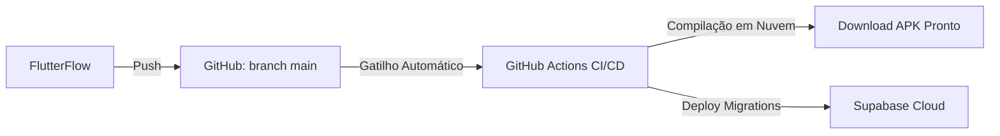

# 🛡️ Lastro Sigma Sistemas — Manual de Operações e Documentação do Projeto

Este documento é a **fonte central** de arquitetura, operações diárias e guia de desenvolvimento do **Lastro Sigma Sistemas**.

---

## 📌 1. Visão Geral do Projeto

* **Nome do App:** Lastro Sigma Sistemas
* **Tipo:** Sistema de Gestão Financeira Corporativa Multi-Organização
* **Tecnologias Principais:**
  * **Framework:** Flutter / Dart (Web, Mobile & Desktop)
  * **Backend / BaaS:** Supabase Cloud (PostgreSQL 17, Auth & Storage)
  * **CI/CD & Cloud Build:** GitHub Actions (Compilação e Deploy em Nuvem)
  * **Gerenciador de Estado:** Provider (`FFAppState`)
  * **Roteamento:** GoRouter
  * **Relatórios & Exportações:** `pdf`, `printing`, `csvlib`
  * **Integração Android:** Intent Filter para recebimento de extratos bancários (`application/pdf`, `application/x-ofx`, `text/csv`)

---

## ☁️ 2. Arquitetura Cloud-First (Sem Sobrecarga Local)

Para garantir máxima performance no hardware de desenvolvimento, o projeto adota uma arquitetura **100% Cloud-First**:

1. **Supabase Cloud (Oficial):** Banco de dados, autenticação e storage operam na nuvem gerenciada. Não é necessário rodar Docker localmente.
2. **Builds no GitHub Actions:** A compilação pesada do Flutter (Android APK) e o deploy de migrations rodam gratuitamente em servidores da nuvem.
3. **Blindagem Local (`.wslconfig`):** A máquina possui teto de recursos configurado para manter o sistema operacional ágil e fluido.

---

## 💻 3. Ferramentas e Scripts de Automação

Os scripts utilitários estão disponíveis em `C:\SIGMA\lastro-app\scripts` e `C:\SIGMA\Automacao`:

| Script | Caminho | Descrição & Quando Usar |
| :--- | :--- | :--- |
| **`1 - Iniciar Ambiente`** | `scripts/start_dev.ps1` | Sincroniza o código com o GitHub (`git pull`). Use no início do dia. |
| **`2 - Aplicar Patch Android`** | `scripts/patch_android.ps1` | Re-aplica as correções do Gradle, Kotlin e o **Share Intent Filter** no `AndroidManifest.xml` após exportar do FlutterFlow. |
| **`3 - Encerrar Expediente`** | `scripts/finish_day.ps1` | Executa o commit e push para o GitHub, disparando a esteira CI/CD na nuvem. |
| **`4 - Build APK na Nuvem`** | `C:\SIGMA\Automacao\build-apk-cloud.ps1` | Envia alterações e abre o GitHub Actions para download do APK. |
| **`5 - Diagnóstico de Saúde`** | `C:\SIGMA\Automacao\status-sistema.ps1` | Exibe o status de espaço no SSD e consumo de memória RAM. |
| **`6 - Lançar no Celular Físico`** | `scripts/run_mobile.ps1` | Compila diretamente no seu smartphone Android via cabo USB/Wi-Fi (ADB). |

---

## ⚡ 4. Fluxo de Integração FlutterFlow + GitHub + CI/CD



1. **Alterações no FlutterFlow:** Desenvolva telas e componentes no FlutterFlow e clique em **Push to GitHub**.
2. **Aplicação de Patch Nativo (Local):** Após o push, se for testar no Android nativo:
   ```powershell
   powershell -ExecutionPolicy Bypass -File scripts/patch_android.ps1
   ```
3. **Build e Teste do APK:**
   * Acesse a aba **Actions** no GitHub: [GitHub Actions - Lastro App](https://github.com/flaviomineiroamaral/lastro-app/actions).
   * Baixe o artefato `lastro-apk-debug` e instale no seu celular.

---

## 🏛️ 5. Arquitetura do Banco de Dados Supabase (`supabase/`)

O backend é fundamentado em PostgreSQL 17 com suporte a views analíticas para alto desempenho financeiro.

### 📋 Tabelas Principais (`lib/backend/supabase/database/tables/`)

| Tabela | Descrição |
| :--- | :--- |
| `organizations` | Cadastro das empresas/organizações atendidas no sistema. |
| `organization_members` | Associação entre usuários (`profiles`) e organizações com papéis/permissões. |
| `membros` | Cadastro de membros de equipes nas organizações. |
| `profiles` | Perfil dos usuários do sistema. |
| `contas_bancarias` | Cadastro de contas correntes, caixas físicos e cartões de crédito. |
| `plano_contas` | Árvore hierárquica do plano de contas contábil/financeiro. |
| `centros_custo` | Centros de Resultado / Custos para alocação orçamentária. |
| `orcamentos_centro_custo` | Metas e orçamentos definidos por Centro de Custo. |
| `transacoes` | Lançamentos financeiros (Receitas, Despesas, Transferências, Agendamentos). |
| `obrigacoes_recorrentes` | Regras de lançamentos periódicos (contas a pagar/receber recorrentes). |
| `historico_saldos` | Registros históricos dos saldos das contas para análise temporal. |
| `resumo_dashboard` / `org_pulse` | Métricas pré-calculadas e indicadores de saúde operacional. |

### 📊 Views Analíticas e Relatórios SQL

* **DRE (Demonstrativo do Resultado do Exercício):** `vw_dre_sintetico`, `vw_dre_analitico`, `vw_dre_detalhado`
* **DFC (Demonstrativo do Fluxo de Caixa):** `vw_consolidado_lastro`, `vw_transacoes_competencia`, `vw_extrato_individual`
* **Centros de Custo (CR):** `vw_resumo_centro_custo`, `vw_balancete_consolidado`

---

## 📱 6. Estrutura dos Módulos da Aplicação (`lib/`)

```
lib/
├── autenticacao/       # Splash, Onboarding, Login, Gestão de Usuários e Seleção de Organização
├── dashboard/          # Visão executiva, gráficos DRE/DFC, alertas e saúde financeira
├── dre/                # Relatórios e análises sintéticas e analíticas de DRE
├── dfc/                # Relatórios e análises de Fluxo de Caixa (DFC)
├── cr/                 # Centros de Resultado (alocações, subsídios e balancete de CR)
├── cadastro/           # Plano de Contas, Contas Bancárias, Pessoas, Obrigações e Ajustes
├── a_receber_a_pagar/  # Previsão de títulos, liquidações e lançamentos recorrentes
├── cartao/             # Gestão de faturas de cartão de crédito
├── importacao/         # Parsing e conciliação de arquivos OFX, CSV e PDF (Recebidos via Share Intent)
└── transacao/          # Extrato individual e detalhes por categoria
```

---

## 🧠 7. Regras de Negócio e Diretrizes Operacionais

1. **Integridade de Lançamentos Contábeis:** Triggers no banco (`public.check_permite_lancamento`) rejeitam lançamentos em contas sintéticas. Somente contas analíticas (`permite_lancamento = true`) aceitam lançamentos.
2. **Deleção Lógica vs Física:** O banco impede exclusão física (`DELETE`) de contas ou centros de custo com movimentação (`public.check_finance_usage`). Utilize desativação/inativação na interface.
3. **Compartilhamento de Banco (Share Intent):** O `AndroidManifest.xml` registra o Intent Filter para `android.intent.action.SEND` capturar arquivos enviados de apps de bancos diretamente para o módulo de importação.
4. **Sem Emuladores Locais Pesados:** Utilize o modo Web leve (`flutter run -d chrome`), o Test Mode do FlutterFlow ou a esteira do GitHub Actions para testar no dispositivo físico.

